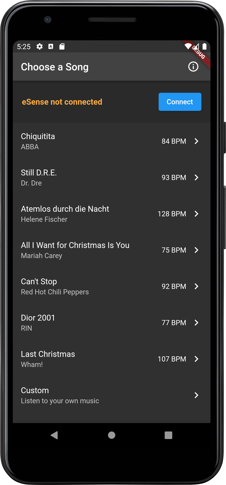

# headbang

This app measures the headbangs of the user using the gyroscope in the connected eSense earable. The user can listen to predefined songs or set their own BPM target, to see how well they can match it.

## Screenshot

